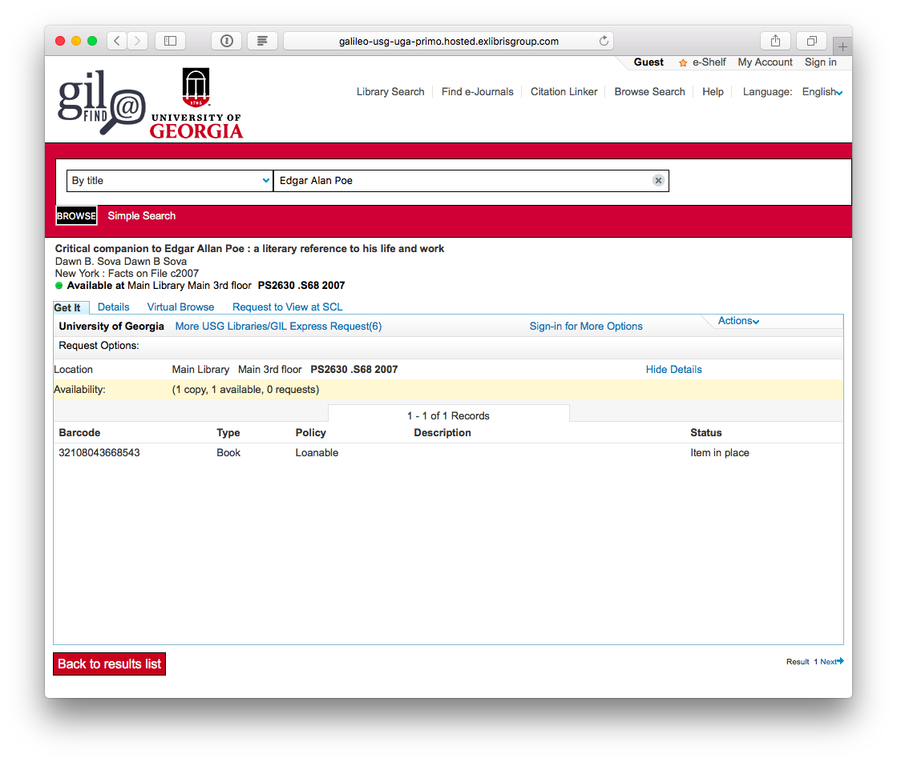
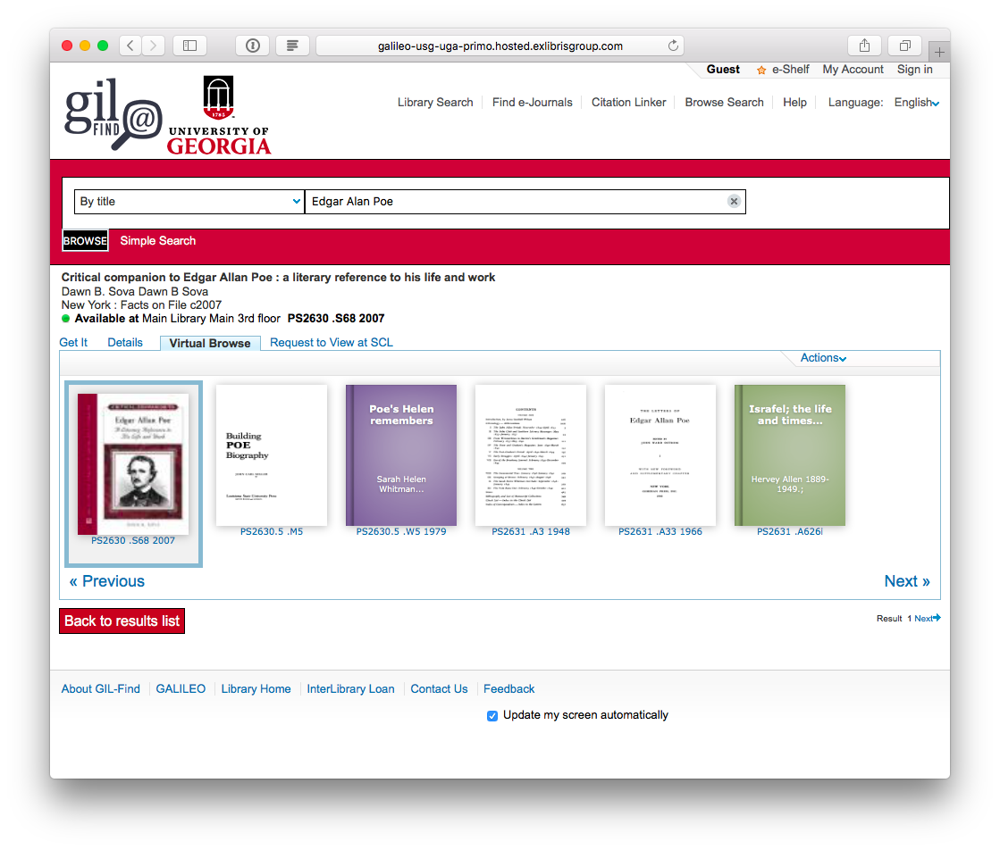
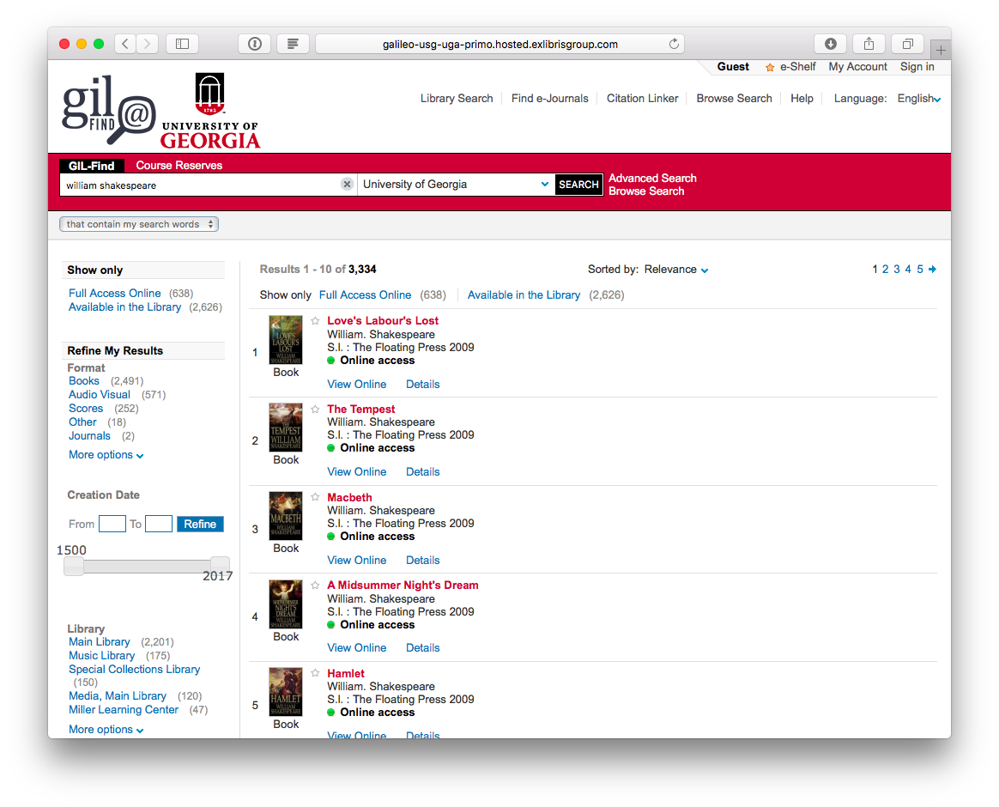
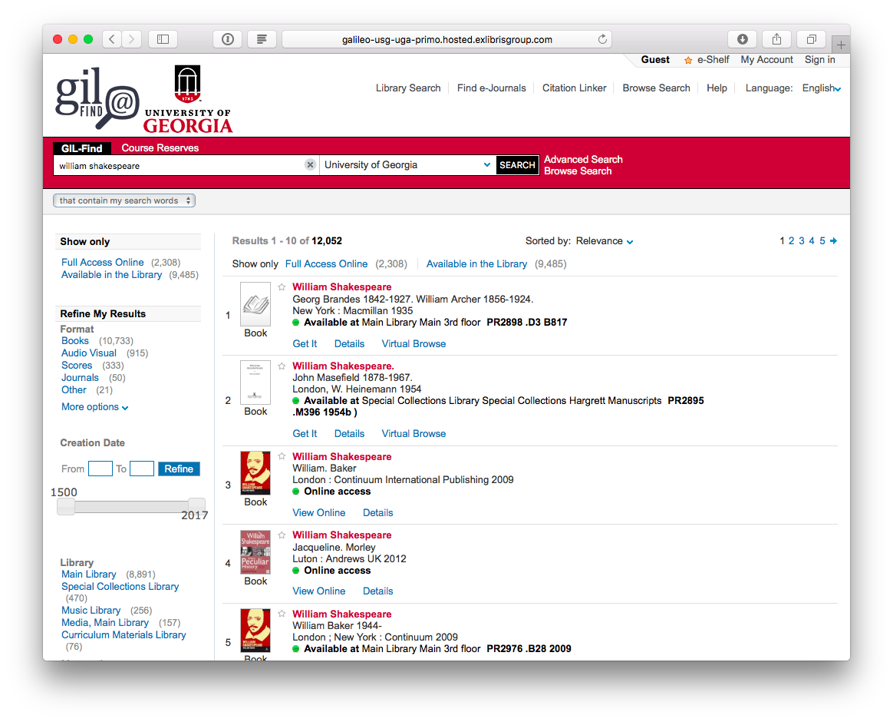
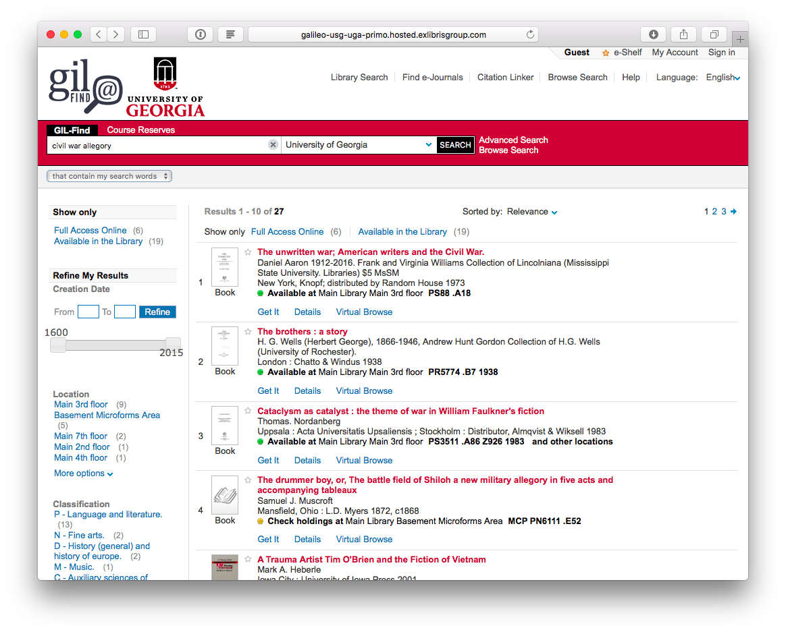

*The director of a fictional library system is seeking a new OPAC, and I was tasked with writing a recommendation for Ex Libris. This was originally written for my Technical Services class in the Fall of 2017.* {.has-large-font-size .alignwide}

The University of Halloween is a four-year research school, and the largest higher-education institution in the state. The university’s library, Skellington Library, has seen a steady increase in usage in recent years. Our OPAC is no longer adequate for our current collection size and web traffic, nor does it support the features that our users expect. Library staff has grown frustrated with its lack of advanced features for them, as well.

In our current digital-focused world, an OPAC creates a first impression of a library. Satisfying our users in that space is important to keep bringing them through the doors. This paper will examine a recommendation for our replacement.

## Recommendation

Alma by Ex Libris is one of the major OPACs designed for academic libraries. It’s popular with schools of all sizes, and is configurable to accommodate a variety of specific needs. Behind the scenes, it can automate workflows and generate statistical reports. It works with open and interoperable standards, which allow it to integrate seamlessly with other computer systems. It is also compatible with a wide range of metadata formats, including MARC, Dublin Core, and Bibframe ([Ex Libris, 2016](http://www.exlibrisgroup.com/files/Ten_Reasons_Why_Alma_is_the_Best_Next_Gen_Solution.pdf)). Library Technology Guides surveyed library OPACs, and found that, “Alma from Ex Libris led as the top performer among large and mid-sized academic libraries for overall functionality, effectiveness in managing electronic resources, and company loyalty and for mid-sized accademics [sic]” ([Breeding, 2017](https://librarytechnology.org/perceptions/2016/)).

We will look at University of Georgia (UGA) as an example to demonstrate Alma’s capabilities in a practical setting. UGA’s university libraries contain a general collection of over 5.2 million titles and serves 37,596 students ([University of Georgia, 2017](http://www.uga.edu/profile/facts/)).

## OPAC Description and Testing

As with most OPACs, Alma starts with a familiar search box. On this “simple search” interface, a dropdown provides the option to limit the search to title, subject, ISBN, and creator. It defaults to “all fields,” which searches the entire MARC record. In the advanced interface, the user can refine their search with more fields and logical statements.

<figure class="aligncenter">

<figcaption>Figure 1: Simple search</figcaption>

</figure>

<figure class="aligncenter">

<figcaption>Figure 2: Advanced search</figcaption>
</figure>

If the user types a search query, Alma delivers a series of results that list the item’s name, author, date, publisher, where the item is available, and the call number. For many searches, this is enough information to not require any additional clicks by the user. (For example, if they see the title they want, see that it’s available, and just need to know the call number to locate it.) On the sidebar, there are controls the further refine the search. The sidebar suggests specific authors, time periods, formats, subjects, and so on. This interface should require little practice for a library user to master, since the information and the controls are logically organized and labeled.

<figure class="alignright">

<figcaption>Figure 3: An example search for "Edgar Alan Poe."</figcaption>

</figure>

When the user views a book, they see a page with the book’s information (the same information from the search results page) along with a tabbed interface with additional details. It defaults the “get it” tab, which shows the book’s location and availability. The “details” tab shows a lot of the book’s MARC information in a user-friendly format

These are the fields the “details” tabs lists, and their corresponding MARC fields:

- Title (240, 245)
- Author(s) (100)
- Subjects (600, 650)
- Contents (505, 520, 590)
- Related Titles (440)
- Publisher (260)
- Creation date (260)
- Physical description (300)
- Language
- Identifier (020)
- OCLC number (035)
- NZ MMS ID (001, MMS)
- IZ MMS ID (MMS)

The “technical view” link, located under this tab, opens the raw MARC data. Another tab that users may find useful is the “virtual browse” view, which simulates what books will be near the book on the physical shelf.

<figure class="wp-block-image">

<figcaption>Figure 4: The "Get It" tab for an item</figcaption>
</figure>

<figure class="wp-block-image">

<figcaption>Figure 5: The "Details" tab for an item. The link to view the raw MARC data is highlighted.</figcaption>
</figure>

<figure class="wp-block-image">

<figcaption>Figure 6: The "Virtual Browse" tab for an item</figcaption>
</figure>

## Search Function Tests

If we do a title search for “King Lear,” for example, we will see every single item that contains those words in its MARC titles fields, 240 and 245. By switching to advanced search, we can specify that the title has that exact phrase, which limits the search further. We can also specify that the title start with that phrase, which would filter out items with titles such as “Critical Companion to King Lear.” Each one of these options narrows the scope of the search, and thus produces narrower results.

<figure class="wp-block-image">

<figcaption>Figure 7: A title search for "King Lear"</figcaption>
</figure>

If we do an author search for “Shakespeare,” Alma returns everything with that keyword in the MARC 100 field. We can use the advanced fields to narrow it to the exact phrase (which won’t affect single-word searches). The “starts with” search option is not available for author searches. If the user searches for an author’s name, but does not select the author field, Alma will search all fields, but seems to default to putting items whose titles contain the search terms at the top of the results.

<figure class="wp-block-image">

<figcaption>Figure 8: An author search for "William Shakespeare"</figcaption>
</figure>

<figure class="wp-block-image">

<figcaption>Figure 9: Searching all fields for "William Shakespeare"</figcaption>
</figure>

If we do a subject search for “southern gothic literature,” we get a wide range of results. Alma seems to find items that contain any of the keywords in any of the 650 fields, and it delivers the items that match the most keywords at the top of the results list. In the advanced search, we can choose to narrow it to an exact phrase. In our example, an exact phrase search of “southern gothic literature” will return zero results, since no 650 field has that exact phrase. We would have to break the keywords up in separate AND fields in order to get the results we want.

<figure class="wp-block-image">

<figcaption>Figure 10: Searching all fields for "southern gothic literature"</figcaption>
</figure>

Finally, if a user just wants to find items based on general keywords, they would use the default “all fields” search option. Suppose we’re researching allegorical literature pertaining to the United States Civil War. If we search for “civil war allegory,” we get any item that matches those keywords. This may be useful for certain searches, such as ones that will rely on lesser-used MARC fields like 520. In this case, that’s where “allegory” most frequently appeared in the item records.

<figure class="wp-block-image">

<figcaption>Figure 11: Searching all fields for "civil war allegory"</figcaption>
</figure>

## Error Handling

Alma’s error handling isn’t always reliable. It can detect that “shakepear” and “shakspear” both need to be changed to “Shakespeare,” and it will suggest that the user change their search. However, “King Leer” simply finds every item with the words “king” and “leer,” and offers no suggestions for a correction. “Edgar Alan Poe,” which is not how Poe’s name is typically spelled, (“Allan” would be correct) will return results that contain works with the keyword Poe but also by authors named “Alan.” There will be some useful results, but they will not be as accurate as the correct spelling would produce.

## Overall Evaluation

Alma is a strong contender for our OPAC and possibly our best choice. Its design is straightforward and logical. The user can find most information with just one or two clicks. The search interface is familiar, and the controls are logical. There are a lot of filter options and advanced search fields, for users who require those. There is even a “technical view” which displays the MARC record, which will be beneficial for library staff. Behind the scenes, Alma’s customizability and advanced features will be useful to the Skellington library staff.

While we only looked at a portion of their total features in our tour of UGA’s search, we could see how attentive-to-detail Ex Libris is in their product. The fact that they are highest-rated for company loyalty is no surprise.

The biggest downside that we experienced in our test-run on UGA was the lack of error correction. The search engine is “dumb” in that it only is as useful as its MARC data. If the user doesn’t know exactly what they want, or doesn’t know all of the information about the item they want, then the OPAC isn’t “smart” enough to find useful items, or offer suggestions to improve their search. Ideally, if a student wishes to find information from our library, they should do all of their searching within our OPAC. However, if they hit the limits of Alma, then they may need to resort to Google, even if just to find the proper spelling of an author or title. That being said, no OPAC’s error correction currently matches Google abilities.

The strengths clearly outweigh the downsides. Alma is definitely designed with academic libraries exactly like ours in mind. It has all of the features that our students, faculty, and other researchers need and expect. The University of Halloween will have a hard time finding an OPAC that exceeds what Alma offers.

## References

1. Breeding, M. (2017). *Perceptions 2016: an international survey of library automation*. Retrieved from https://librarytechnology.org/perceptions/2016/
2. Ex Libris. (2015). *Why your library should move to ex libris alma*. Retrieved from http://www.exlibrisgroup.com/files/Products/Alma/WhyAlma.pdf
3. Ex Libris. (2016). *Ten reasons why ex libris alma is the best next gen solution*. Retrieved from http://www.exlibrisgroup.com/files/Ten_Reasons_Why_Alma_is_the_Best_Next_Gen_Solution.pdf
4. University of Georgia. (2017 *UGA by the numbers*. Retrieved from http://www.uga.edu/profile/facts/
5. University of Georgia. (n.d.) *UGA libraries*. Retrieved from http://www.libs.uga.edu/