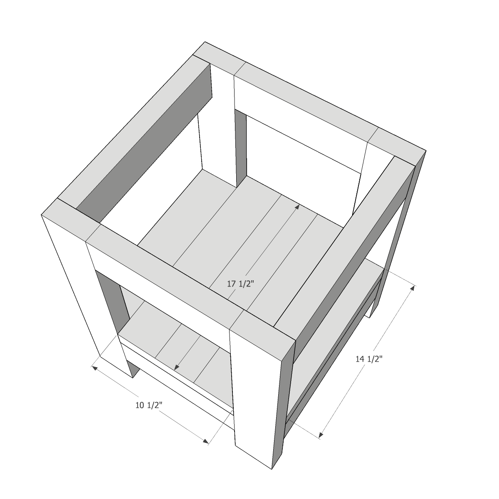

A while back, I inherited a marble chessboard that had once been the top to a beautiful table. The metal base had rusted away long ago, but I believed that I could restore this table to new glory. All I needed was my toolbox and some 2x4s.

I adapted most of this design from [Ana White’s “Tryde End Table with Shelf” plan](http://www.ana-white.com/2013/10/plans/tryde-end-table-shelf-updated-pocket-hole-plans). I highly recommend checking out her website in addition to this guide. There are two main differences between my plan and hers. First, I attached a marble tabletop instead of building one from wood. Second, I resized the table into a square that would fit under the marble. With a bit of math, I found the optimal size that can comfortably fit the 2x4s in the shelf without any extra cutting.

## Shopping List

- 3 - 2x4 @ 8 feet long (Legs, aprons, &amp; shelves)
- 1 - 2x4 @ ~3 feet long (stretchers)<a id="ffn1" class="footnote" href="#fn1">1</a>
- 2 1/2” pocket hole screws
- 4 1/4” dowel pins
- Stain (optional)
- Polyurethane (optional)
- Paint (optional)

## Tools

- Tape measure
- Speed square
- Kreg Jig
- Drill
- Sander
- Saw
- Pencil
- Safety glasses

## Cut List

- 4 - 2x4 @ 22 1/2” (Legs)
- 4 - 2x4 @ 10 1/2” (Short aprons)
- 6 - 2x4 @ 14 1/2” (Long aprons &amp; short shelves)
- 3 - 2x4 @ 17 1/2” (Long shelves)
- 2 - 2x4 @ 14 1/2” (Stretchers)

## Cutting the wood

I calculated the most efficient use of wood, and here’s how I cut almost everything from just three 2x4s:

<figure class="wp-block-image alignwide">

</figure>

Not included on this diagram is the two stretchers,which I cut from some old scrap wood. Unlike the other cuts, the stretchers are never visible once the table is complete, so they don’t need to look pretty.

## General instructions

Everything attaches with 2-1/2” pocket hole screws drilled into 1-1/2” pocket holes. For each apron, you should predrill 2 holes into each end. Make sure that when you attach the aprons to the legs, that the holes are facing inward.

## Step 1

Attach the short aprons to the narrow ends of the legs. Do not fully tighten the screws.

<figure class="aligncenter">

</figure>

## Step 2

Attach the long aprons to the wide ends of the legs. Do not fully tighten the screws.

<figure class="aligncenter">

</figure>

## Step 3

Attach the shelf boards together using pocket hole screws on the bottom of each. Then, slide the whole shelf into the table. On the inside of the aprons, drill pocket holes facing upward. Once the shelf is secure, tighten all screws. Fasten the aprons to the shelf with screws in the holes you just drilled.

<figure class="aligncenter">

</figure>

## Step 4

This step required some creativity for me. My marble tabletop had four holes in the bottom to attach to its base. However, these holes weren’t aligned evenly. With a little bit of measuring and a little bit of trial and error, I found out how to best place my slats. I drilled 1/4” holes and hammered dowel pins inside. These could then slide into the holes to secure the top.

<figure class="aligncenter">

</figure>

Some marble tables don’t attach to their bases. Marble is heavy, and the table top will likely never slide without a lot of force. You can actually skip this step all together without a problem. However, I like to move my furniture around, so having the extra stability makes me more comfortable.

## Almost complete!

<figure class="alignleft">

</figure>

All that’s left is sanding and staining or painting, if you choose to do so. One of the best things about building your own furniture is that you can make it can look however you want!

---

<ol><li id="fn1">I just used old scrap wood for the stretchers. <a href="#ffn1">↩︎</a></li></ol>