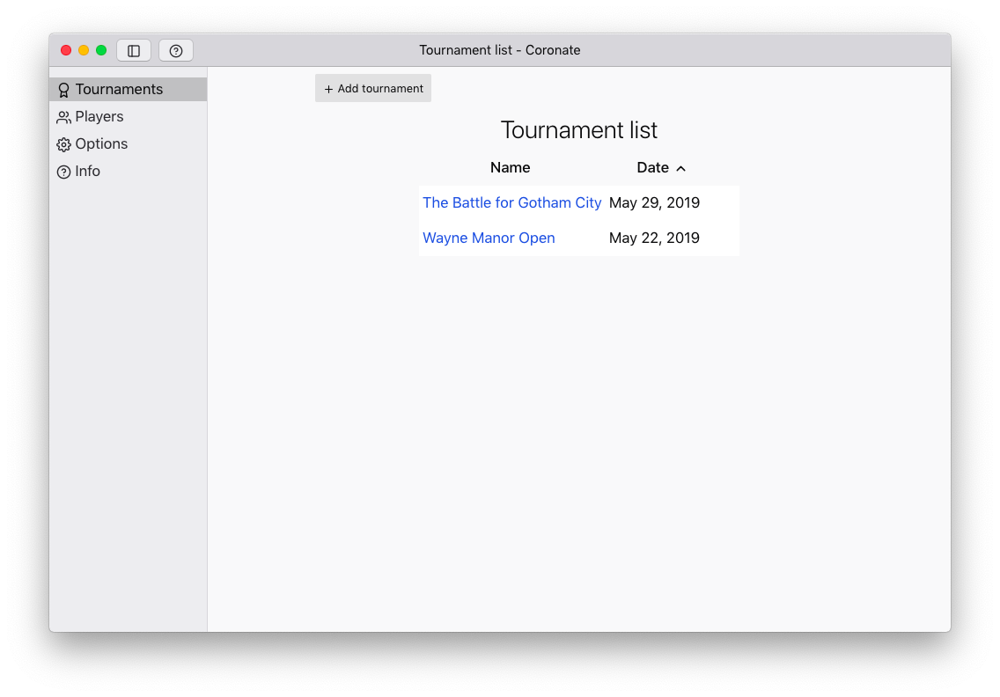
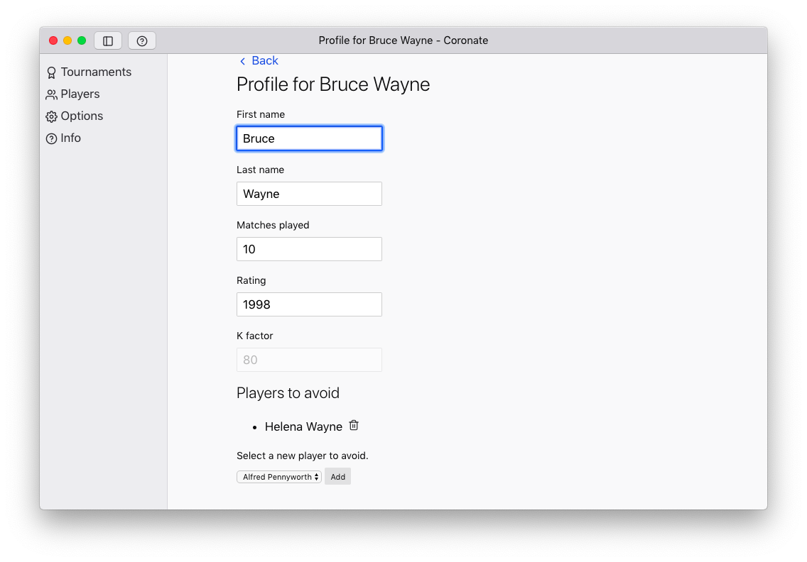

Coronate is a free, open-source app for managing Swiss-style chess tournaments.

<a class="button-link__link" href="https://johnridesa.bike/coronate/">Launch Coronate in your browser</a>

<a class="button-link__link" href="https://github.com/johnridesabike/coronate/releases/latest">Download Coronate for Mac or PC</a>

<a class="button-link__link" href="https://github.com/johnridesabike/coronate">Browse the source code</a>

## 🧐 About

I began working on Coronate shortly after hosting a tournament at Chattahoochee Valley Libraries. I discovered a dearth of free software, so I and decided to change that. Library employees deal with limited budgets and restrictive computer access, so purchasing, installing, and learning to use specialized tournament software is usually a considerable barrier-to-entry.

Coronate aims to solve this problem. It’s free, open source, and runs on almost any system. Although it (probably) won’t replace a professional app in a rated tournament, it fills the gap for small clubs or public events.

Coronate is in a "proof-of-concept" phase. It should work fine, but it's optimized for small groups and specific conditions. Adding features, even small ones, is time consuming, so work is prioritized based on the real-world needs of its users. [If you would like to contribute your feature ideas, it's easy!](https://github.com/johnridesabike/coronate/blob/master/CONTRIBUTING.md)

## 🔧 Setup

Coronate is built in the language [Reason](https://reasonml.github.io) with the [React](https://reactjs.org/) library, so you can run a copy of it right in your browser, no installation required.

You can also download the standalone version. It is literally the same code as the web version, except it’s wrapped in [Electron](https://electronjs.org/). The main reason to use the standalone version is it separates your data from a specific browser.

## ♟ How to use it

Coronate tournaments use the Swiss-style system. For the unfamiliar, [my article on running your first chess tournament](http://programminglibrarian.org/articles/your-library%E2%80%99s-first-chess-tournament-opening-endgame) can explain how the logistics work. While understanding those is helpful, Coronate should effortlessly manage the nitty-gritty for you.

### Rounds

After you make a tournament and add your players, you can create a new round. There is a basic interface to help you pair players, but you should almost always use the “auto-pair players” button. Typically, just resort to manual pairing if the auto-pair results cause a problem.

Once the players are paired, the pairings will be listed in a numbered order. These numbers would typically correspond to specific tables or chess sets you have. The round screen provides controls to rearrange these pairings, swap players’ colors, or unpair the players. Of course, you can also set the result of each match.

Once each match has been completed, you can begin pairing the next round.

You can add or remove players from your tournament at any time (such as late entries or players who have left). 

### Other tournament pages

Besides the rounds, there are a few other pages for each tournament:

- **Tournament status** displays the current standings alongside the most recent round’s matches. This serves as a quick overview of the most pertinent information, something to display in the background while the tournament is in progress.
- **Crosstable** displays a table showing every player’s results with every other player, along with their rating gain or loss.
- **Score detail** displays exactly how the standings are calculated: which tiebreak methods are used, what order they’re in, and what the result of each scoring method is for each player.

### Players

Outside of tournaments, there is also a page for managing players. If you open a player profile, you can specify which other players they should *never* be paired with. For example, you can use this to prevent matches between family members.

**Ratings** are calculated after each match and saved to each player’s profile. This uses a very basic rating algorithm, and isn’t predictive of a USCF or FIDE rating.

You can edit other player data as well, but you typically won’t need to.

## 🗃 Managing tournament data

Unlike most web apps, Coronate doesn’t keep your data in “the cloud” (e.g. someone else’s computer). Instead, your data is saved to your browser’s storage. This mostly works well, but it comes with caveats: a) moving data from one device to another is frustrating, b) backing up and making copies of data is frustrating, and c) browsers manage their data differently from each other and are sometimes eager to quietly delete or restrict storage.

Coronate addresses these in a couple of ways. First, you can manually load and save your data through its “options” screen. If you create a tournament on your work laptop and want to ensure its records are preserved, just go to the options and save the file somewhere safe. At any point, you can open Coronate again and load the data. Second, you can use the portable Electron version for Windows (only the Windows version is portable). This will give you a standalone *.exe* file and a *data* folder that you can save where you want: a USB drive, your DropBox, wherever.

## 🌅 The future

Coronate is currently 1.0 status, mostly bugfree and with all of the basic functionality. There are still plenty of features that can go into the next version, but I haven't decided yet what to focus on.

One common suggestion has been to make it compatible with other games that use Swiss-style tournament structures. If you have a specific game that you would like to see it support, just let me know.

## 🤓 Behind the scenes

### Scoring

I modeled the scorekeeping code after the specifications by the USCF. When appropriate, the code should have comments indicating the specific section of the rulebook they come from. Not all scoring rules are implemented (yet), just the commonly used ones.

[USCF’s scoring guidelines can be found on their rulebook, which is freely downloadable here.](http://www.uschess.org/content/view/7752/369/)

### Pairing

Similar to scoring, the auto-pairing functions aim to comply with USCF recommendations. Pairing is a much trickier beast than scoring, however. The current implementation is “good enough” for now, and still needs more work.

### Source code

Coronate is written with [Reason](https://reasonml.github.io), [ReasonReact](https://reasonml.github.io/reason-react/), and [BuckleScript](https://bucklescript.github.io). Reason is an extension of the OCaml programming language, and BuckleScript provides a JavaScript compiler along with a standard library optimized for web usage.

All code is [AGPL v3.0 licensed](https://github.com/johnridesabike/coronate/blob/master/LICENSE) which allows anyone the freedom to download and modify it. If you are interested in using parts of the source for your own project (e.g. the scoring or pairing algorithms), let me know and I'm happy to release those modules under a more liberal license for you. I welcome contributions in code, as well as suggestions and bug reports. [Visit the repository page to get started](https://github.com/johnridesabike/coronate/).

## Screenshots

